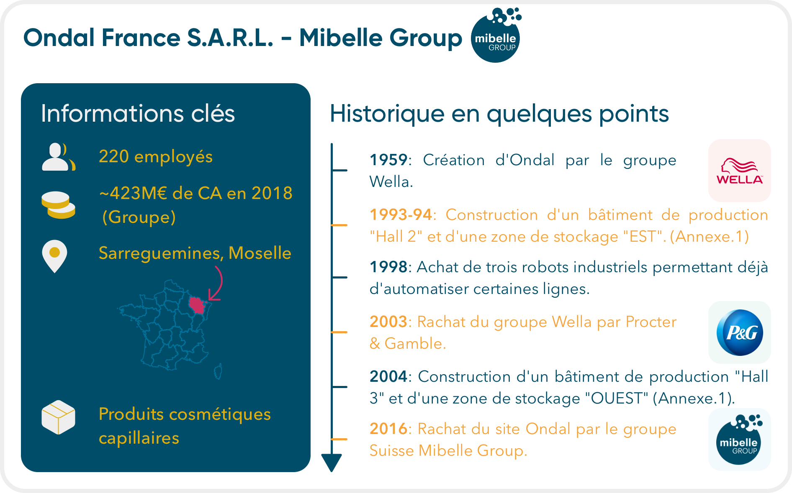

\newpage

#   Entreprise & Environnement

##  Identité de l'entreprise

### Généralités

L'entreprise **Ondal France**[^1] est une *Société à Responsabilités Limitées* (S.A.R.L.) située au *2 rue Denis Papin*, à *Sarreguemines*, en *Moselle* région *Grand-Est*; et spécialisée dans la fabrication de produits cosmétiques capillaires depuis sa création en 1959.\
Au moment de l'écriture de ce rapport, celle-ci est constituée de 220 employés répartis en plusieurs postes, dits de **matin** (6h-14h), **jour** (8h-16h), **après-midi** (14h-22h), et **nuit** (22h-6h). 

\newpage

##  Historique

### Création par le groupe Wella

À l'origine, celle-ci a été créée par le groupe allemand Wella en 1959, et n'était constitué que d'un seul hall de production, le **hall 1**.[^2] Les années 1990 ont montrées une volonté forte de s'étendre; avec le **hall 2** en 1992, le stockage **«est»** en 1993, et le rachat des locaux d'une entreprise voisine en 1996.\
L'année 1998 marque l'acquisiton de premiers robots industriels destinés à automatiser certaines tâches, comme de la mise en cartons de bouteilles. Enfin en 2000, la construction du magasin **ouest** est terminée. 

### Période creuse avec Procter & Gamble

À la suite du rachat du groupe **Wella** par **Procter & Gamble** (*P&G*) en 2003, l'entreprise subit plusieurs modifications aussi bien structurelles qu'organisationnelles. On passe d'une organisation pyramidale à une **organisation matricielle**[^3]. L'usine se dote d'un nouveau hall de production d'environ 4000$m^2$, le **hall 3**, qui est à ce jour le dernier, et le plus gros. Enfin, une première politique de développement durable est mise en place, avec un traitement local de toutes les eaux usées.\

### Nouveau souffle du groupe Mibelle

Entre le milieu des années 2000 et 2016, l'entreprise est dans une situation plutôt mauvause. Tensions sociales, manque d'investissements et problèmes d'organisation sont présents. De gros changements sont arrivés en 2016 suite au rachat de l'entité Ondal par le groupe **Mibelle Group[^4]**, filliale du groupe *Suisse* **Migros**.\ Encore une fois, de gros changements organisationnels sont apportés, comme par exemple la modification de services internes à l'entreprise. De plus, une politique de développement durable et du bien-être humain est adoptée, considérant à présent que les employés sont le cœur de l'entreprise. Ces changements ont contribué à une croissance de 10% par an depuis 2016.

##  Activité de l'entreprise 

##  Partenaires

##  Organisation

[^1]:   Dans un soucis de simplicité, je l'appellerai simplement **Ondal** par la suite.
[^2]:   Voir le plan de l'usine en annexe.1.
[^3]:   Voir {organisation}.
[^4]:   Encore une fois, j'utiliserai soit le terme **Mibelle**, soit **groupe Mibelle** lors de ce rapport.
