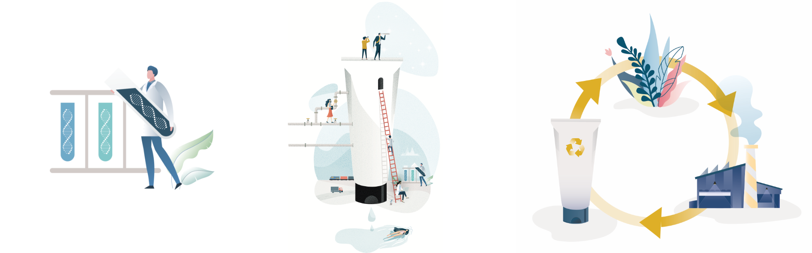
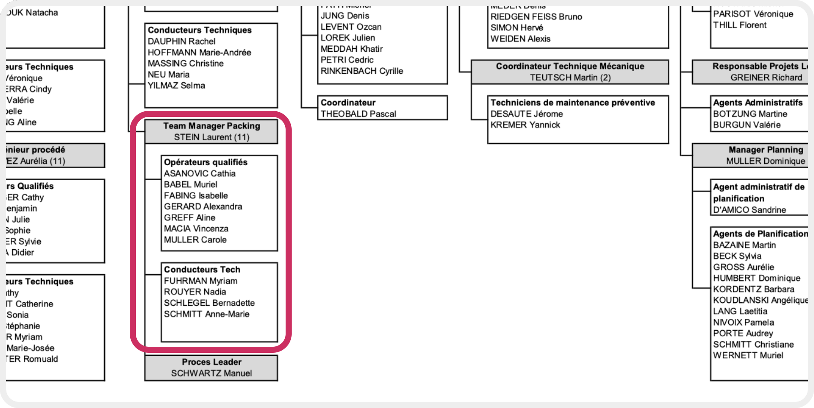

\newpage

#   Entreprise & Environnement

##  Identité de l'entreprise

#### Généralités\

L'entreprise **Ondal France** est une *Société à Responsabilités Limitées* (S.A.R.L.) située au *2 rue Denis Papin*, à Sarreguemines, en Moselle région Grand-Est; et spécialisée dans la fabrication de produits cosmétiques pour le corps et les cheveux depuis sa création en 1959. Elle appartient au groupe **Mibelle Group**[^4], depuis 2016.

Au moment de l'écriture de ce rapport, l'entreprise est constituée de 220 employés répartis en plusieurs postes, dits de matin (6h-14h); jour (8h-16h), après-midi (14h-22h), et nuit (22h-6h), permettant d'avoir une continuité de fabrication. Parmi ces 220 employés collaborateurs, environ 200 sont en CDI, le reste étant soit en CDD, intérimaire, alternant ou stagiaire.

\newpage

##  Historique

### Création par le groupe Wella

À l'origine, celle-ci a été créée par le groupe allemand **Wella** en 1959, et n'était constituée que d'un seul hall de production, le **hall 1**.[^2] Les années 1990 ont montré une volonté forte de s'étendre; avec le **hall 2** en 1992, le magasin dit **est** en 1993, et le rachat des locaux d'une entreprise voisine en 1996.\
L'année 1998 marque l'acquisiton de premiers robots industriels destinés à automatiser certaines tâches, comme la mise en cartons de bouteilles. Enfin en 2000, la construction du magasin **ouest** est terminée. 

### Période creuse avec Procter & Gamble

À la suite du rachat du groupe **Wella** par **Procter & Gamble** (*P&G*) en 2003, l'entreprise subit plusieurs modifications aussi bien structurelles qu'organisationnelles. On passe d'une organisation pyramidale à une **organisation matricielle**[^3]. L'usine se dote d'un nouveau hall de production d'environ 4000m$^2$, le **hall 3**, qui est à ce jour le dernier, et le plus gros. Enfin, une première politique de développement durable est mise en place, avec un traitement local de toutes les eaux usées ainsi qu'un tri très sélectif des déchets.

### Nouveau souffle du groupe Mibelle

Entre le milieu des années 2000 et 2016, l'entreprise est dans une situation plutôt mauvaise. Tensions sociales, manque d'investissements et problèmes organisationnels sont présents. De gros changements sont apportés en 2016 suite au rachat de l'entité Ondal et de ses locaux par le groupe Mibelle, entreprise du groupe Suisse **Migros**.\ Encore une fois, l'organisation interne est modifiée, notamment avec certains services et outils. De plus, une politique de développement durable et de bien-être humain est adoptée, considérant à présent que les employés sont le cœur de l'entreprise. Ces changements ont contribué à une croissance de 10% par an depuis 2016.

\newpage

##  Activités de l'entreprise

L'entreprise Ondal appartient à l'entreprise Mibelle Group, elle-même entreprise du groupe Migros. Ondal France constitue uniquement l'entité juridique; par exemple, elle ne dispose même pas de logo. Ainsi, il est plus intéressant de commencer par présenter l'entreprise Mibelle et non l'entité Ondal France.

### Mibelle Group

Mibelle est une entreprise appartenant au géant de la distribution Suisse **Migros**, fabricant de produits cosmétiques et d'hygiène aussi bien pour la marque Migros, que pour des marques tierces. Il existe également une filiale, Mibelle *Biochemistry*, dédiée à la recherche et au développement d'ingrédients actifs pour des applications cosmétiques.\ 

À ce jour, le groupe Mibelle comporte 1 250 employés de 36 nationalités différentes, avec une parité de 46% de femmes et 54% d'hommes. Répartie sur six sites en *Suisse*, *France*, *Grande-Bretagne* et *Corée du Sud*, elle a réalisé un **chiffre d'affaires de 650M de francs suisse** (CHF) en 2019.\

Telle qu'elle se décrit, ses valeurs sont autour de la **passion** à performer et s'améliorer; son **engagement** envers l'environnement et le respect de ses clients; sa **volonté** d'innover en continu; et son **impact** pour contribuer au bien-être de ses clients sur la durée.\

\newpage

Mibelle repose sur quatre branches;

*   **Personal Care & Beauty** : Produits cosmétiques pour les humains.
*   **Home Care** : Produits d'hygiène et d'entretien pour les ménages.
*   **Nutrition** : Produits et graisses destinés à l'alimentation.
*   **Biochemistry** : Principes actifs pour divers secteurs.

L'entreprise Ondal, se trouve dans le branche *Personal Care & Beauty*, qui conçoit, fabrique et conditionne des produits cosmétiques se voulant respectueux de l'environnement et du consommateur. Ainsi, ses clients sont aussi bien professionnels que personnels;

|   Client   |  Description  |
|:-----------|:--------------|
|   Professionnels  |   Produits adaptés à des besoins spécifiques des professionnels; comme les soins bucco-dentaires. |
|   "MBO" (Multiple Brand Owners)   |   Groupes possédant plusieurs marques et dont des professionnels peuvent être clients, comme des coiffeurs.    |
|   Détaillants |   Marques propres vendant au détail.  |
|   Consommateurs   |   Produits semi-professionnels destinés à la grande consommation. |
Table: Différents clients du groupe Mibelle.

### Entreprise Ondal

Comme présenté précédemment, l'entreprise Ondal est spécialisée dans la fabrication de produits cosmétiques pour le corps et les cheveux depuis sa création.\
Sur site, arrivent les matières premières des différents produits fabriqués, le principal étant le **péroxyde d'hydrogène** (plus connue comme eau oxygénée sous sa forme aqueuse, de formule $H_{2}O_{2}$). Plusieurs services se relaient, pour créer les **jus**[^5], les conditionner, et les emballer prêts pour l'expédition.

\newpage

##  Organisation

L'entreprise Ondal est organisée selon un **modèle matriciel**. Comme dans toute entreprise structurée, il existe des services (ou départements) qui sont chacun en charge d'une partie précise du fonctionnement de l'entreprise, mais pas nécessairement d'un produit en particulier. Ces différents départements sont répertoriés dans le tableau ci-dessous :

|   Département    |   Fonction et description  |
|:-----------------|:---------------------------|
|   Engineering |   Conception, développement et protection des technologies, systèmes, et bâtiments de production. |
|   Finances    |   Prédiction et gestion des coûts de production et de fonctionnement de l'entreprise.    |
|   Logistique/Planning |   Suivi et gestion des flux pour fournir les différents services et clients.  |
|   Making  |   Fabrication des jus à partir des matières premières.    |
|   MPD[^6] |   Standardisation et optimisation des formules, emballages, processus, matériaux, équipements et procédures.  |
|   Packing |   Conditionnement des produits.   |
|   Qualité |   Vérification et recherche d'amélioration concernant la qualité des formules et des processus de fabrication.    |
|   Ressources Humaines |   Gestion et coordination des différents employés de l'entreprise.    |
Table: Départements de l'entreprise Ondal.

Ces différents départements sont hiérarchisés de telle sorte que chaque branche soit indépendante en terme de gestion. Les gestionnaires, sont alors appelés des "**LMT**", pour *Leader Management Team*.

Ces LMT, rendent ensuite compte au PDG de l'entreprise; **Monsieur Gaëtan PERZO**.

\newpage

### Position dans l'entreprise

Lors de la section suivante concernant l'activité en entreprise, on verra que je suis amené à travailler avec de la documentation existant majoritairement dans le département "Packing". Bien que le besoin et la solution apportée puissent être étendus à tous les départements, j'ai majoritairement travaillé avec les personnes du département Packing; mon tuteur de stage est un des responsable d'une ligne de conditionnement. 

{width=75%}

 >  L'organigramme complet se trouve en **Annexe 2**.

Physiquement, j'étais en open-space dans des bureaux du hall 3[^2]. Situé au premier étage des lignes de production, je travaillais avec les ingénieurs responsables des lignes, les différents directeurs des halls de production, ainsi qu'une partie de l'équipe en charge de la logistique pour la production. Cela m'a permis de pouvoir échanger et mieux comprendre l'organisation de l'entreprise.

[^2]:   Voir le plan de l'usine situé en **Annexe 1**.
[^3]:   Voir l'organigramme des employés en **Annexe 2**.
[^4]:   Encore une fois, j'utiliserai soit le terme Mibelle, soit groupe Mibelle lors de ce rapport.
[^5]:   Le jus est le terme utilisé pour désigner le produit contenant les principes actifs.
[^6]:   MPD signifie **Materials, Process & Delivery**.
