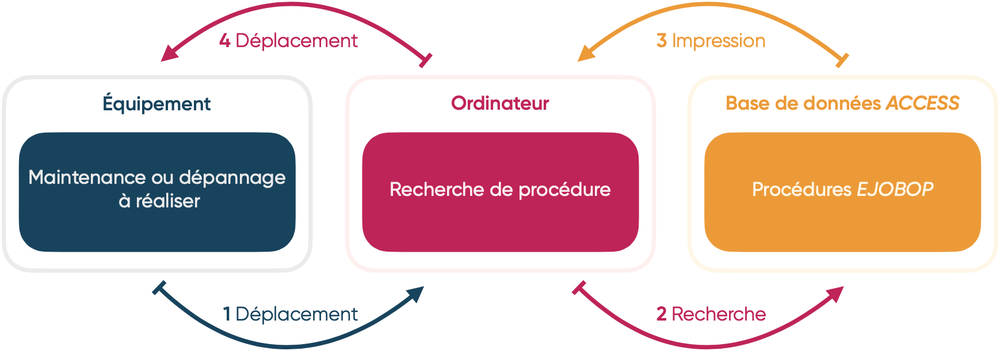
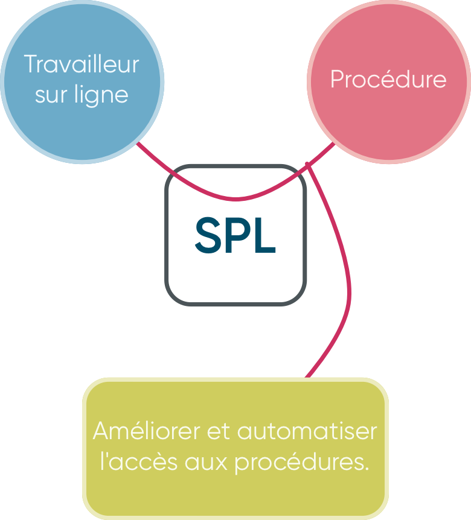
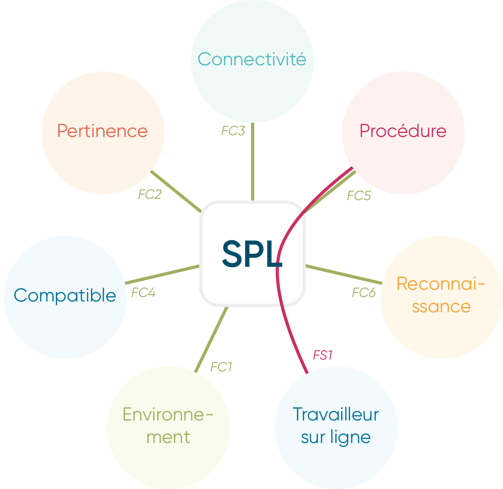
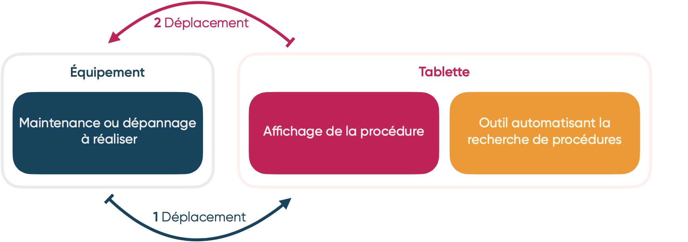
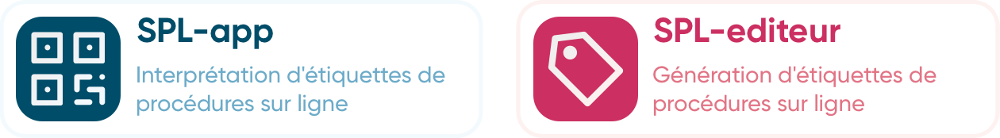
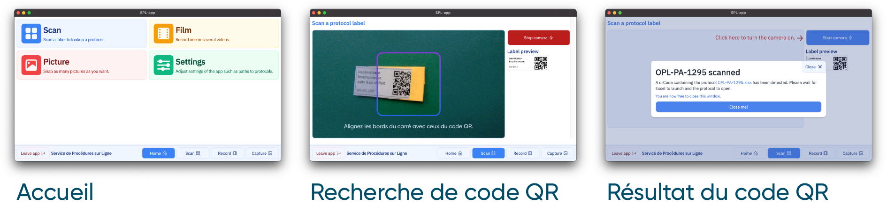
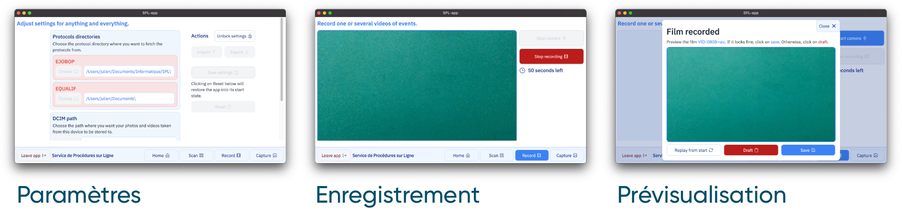
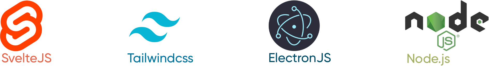
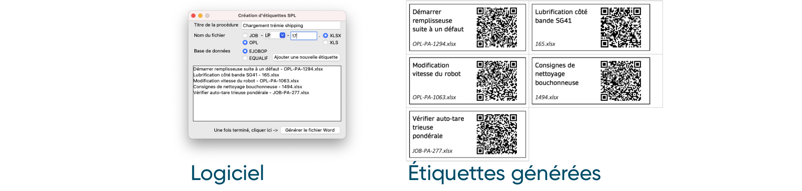
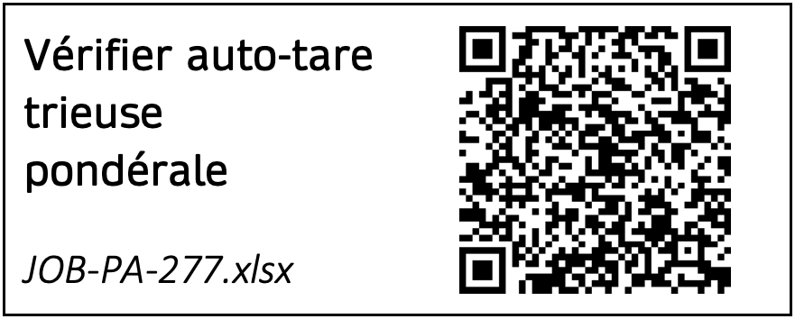

\newpage

#   Réalisation de la mission de stage

Au cours de cette section, nous allons aborder le travail effectué au cours du stage en lui-même. Nous allons partir d'une présentation de l'existant, de la problématique lors de mon arrivée en entreprise et du besoin qui en découle; pour ensuite voir comment une solution a pu être imaginée et si elle permet de répondre à ce besoin.\

Dès mon arrivée, Monsieur Laurent STEIN, mon tuteur de stage, m'a guidé pour utiliser une méthode de gestion de projet: le **PDCA**. Je l'ai légèrement adapté pour obtenir la méthode **PSDCA**, à cause du temps limité lors de ce stage de 12 semaines. À la place d'essayer de potentielles solutions, je choisis directement une solution à partir du périmètre du projet, qui me servira de fil rouge tout le long du projet.

|   Étape   |  Description  |
|:-----------|:--------------|
|   Plan  |   Identification et établissement du périmètre du projet. |
|   Seek  |   Recherche de solutions et bilan faisable / non-faisable. |
|   Do   |  Développement de la solution retenue.   |
|   Check |   Mise en production et recherche de résultats.  |
|   Act   |   Amélioration et optimisation à partir des résultats. |
Table: Étapes de ma méthode de gestion PSDCA.

La première étape étant la planification du projet, il convient de définir dès maintenant plusieurs éléments; l'objectif de stage, et la problématique. Ces deux éléments nous permettrons de définir le périmètre du projet, de déterminer les contraintes pertinentes et de trouver une solution proposant le meilleur compromis.

\newpage

##  Objectif de stage

Tel qu'il a été défini dans la convention de stage, l'objectif (ou l'intitulé) est le suivant:

 >  Création d'un support informatique sur les procédures de travail sur ligne.

Bien que cet intitulé soit assez explicite, il peut être ambiguë; Un support physique ou logiciel ? Qu'est-ce qui est défini comme une procédure de travail sur une ligne ?\
Pour simplifier les choses, il est question lors de ce rapport de **créer un logiciel-outil informatique permettant d'accéder à des documents de maintenance et de formation de divers équipements présents sur des lignes de production**.\

Dans un premier temps, cet outil sera déployé sur une ligne d'essai; la ligne **SG41**.

##  Problématique

Comme vu lors de la présentation de l'entreprise, Ondal est un site de production de produits. Afin d'assurer le bon fonctionnement de l'usine et une bonne qualité de produits, il est nécessaire d'instaurer des procédures uniformisant les actions à mener. Le but est que n'importe qui, après avoir lu une procédure, soit capable d'effectuer les actions qui y sont décrites. Par exemple, où et comment lubrifier un rail de guidage d'une remplisseuse de bouteilles.\
Ces procédures, servent alors à la fois de formation pour les nouveaux personnels, et de rappel si des opérations plus complexes sont nécessaires.\

Dans l'état actuel des choses, ces procédures sont des feuilles de données *Excel* stockées dans des dossiers sur un disque réseau partagé. Afin de les consulter, il est fortement recommandé d'utiliser des bases de données *Access* crées pour. Celle contenant les procédures de formation sont dans la base de données **eQualif**, les autres dans la base **eJOBOP**.\

Le soucis, c'est qu'il est très souvent fastidieux et compliqué d'accéder à une procédure en particulier. Par exemple, la procédure associée au vidage de la mémoire tampon d'une trieuse pondérale de la ligne **SG41**, a comme entrée de titre "*Reset Checkweigher*", tandis que toutes les autres trieuses pondérales ont un nom différent.\
De plus, cette base de données est uniquement accessible sur un ordinateur souvent éloigné de l'équipement. Ainsi, cela représente une perte de temps pour à la fois se déplacer sur un ordinateur, mais aussi pour rechercher une procédure en particulier.



Le besoin est alors plutôt clair : il s'agit de **trouver une solution pour automatiser et améliorer la recherche et l'accès des procédures pour un équipement donné**.

## Périmètre du projet

Une fois le besoin identifié, il nous reste à établir le périmètre du projet pour avoir une idée claire de la solution à envisager.\
L'outil est en majorité destiné aux opérateurs et techniciens sur une ligne de production. On peut dès lors déterminer les acteurs comme suit:

 *  **Cibles** : Toute personne travaillant sur ligne de façon régulière ou non.
 *  **Fonction** : Améliorer et automatiser l'accès à des procédures d'utilisation, maintenance, formation et réparation disponibles sur un disque en réseau partagé.
 *  **Matière d'œuvre** : Ligne de production sur site.
 *  **Produit & service** : *Service de Procédures sur Ligne* (**SPL**).

À partir de ces élements, il est possible d'utiliser les outils APTES et FAST pour visualiser les contraintes nécessaires en vue de l'établissement du cahier des charges;

\newpage

####    Diagramme FAST

L'outil FAST nous permet d'associer les différents éléments de notre périmètre de projet, pour en obtenir une vue d'ensemble en vue de la recherche de contraintes auxquelles doit répondre notre solution.

{width=35%}

####    Diagramme APTE

Les points clés pris en compte, sont l'**ergonomie** en vue de l'utilisation de l'outil par un travailleur sur ligne, la **connectivité** et l'**intégration avec son environnement**, ainsi que l'**automatisation** du processus. 

{width=50%}

| Fonction |  Description                                                                                          | Flexibilité |
|----------|:------------------------------------------------------------------------------------------------------|:------------|
|   FS1    |   Permettre l'automatisation et améliorer l'accessibilité des procédures sur une ligne de production. |  S0         |
|   FC1    |   Doit pouvoir être utilisé en environnement industriel.                                              |  S1         |
|   FC2    |   Doit fournir une procédure pertinente à la demande.                                                 |  S0         |
|   FC3    |   Doit pouvoir récupérer uniquement les procédures disponibles sur un disque réseau partagé.          |  S0         |
|   FC4    |   Doit être compatible avec n'importe quelle ligne de production.                                     |  S1         |
|   FC5    |   Doit être compréhensible et utilisable par un travailleur sur la ligne.                             |  S1         |
|   FC6    |   Doit pouvoir identifier la demande rapidement et automatiquement.                                   |  S1         |
Table: Fonctions de service et contraintes de notre système.

###  Contraintes

Nous pouvons maintenant nous intéresser aux contraintes à la fois généralistes et techniques de notre projet;

 *  Système **portable**, avec recours à l'utilisation de tablettes numériques sous Windows.
 *  **Ergonomique**, qui nécessite pas ou peu de formation et soit simple à l'utilisation.
 *  **Compatible avec les infrastructures existantes** comme les disques en réseau.
 *  "**Future-proof**", utilisant des technologies dites "LTS"[^7], n'ayant pas de dépendances externes et des versions bloquées.
 *  **Technologies en libre-accès** ou sous licence dont dispose l'entreprise, comme le pack *Office 365*.
 *  **Processus automatisé**, avec utilisation de codes-barres disposant de la procédure encodée.

####    Licences

Un détail auquel je n'avais pas initialement pensé concerne les licences utilisées. En tant que particulier, je ne suis pas amené à réellement m'en occuper puisque la totalité des logiciels et outils que j'utilise n'ont pas pour vocation à être re-distribués à des personnes tierces. Cependant, dans le cadre professionnel, il est nécessaire de prendre en compte les licences utilisées pour développer un outil.

####    Automatisation

Comme exposé précédemment, une des contraintes de notre solution est l'automatisation. Celle-ci m'a été guidé par mon maître de stage, qui m'a imposé l'utilisation d'étiquettes avec un code-barre disposant du nom de la procédure à rechercher sur le réseau. Ces étiquettes seront placées directement sur l'équipement concerné.\

L'objectif est d'obtenir une solution qui corresponde au diagramme suivant.



Pour avoir une fonctionnalité d'automatisation, l'idée retenue est la création d'étiquettes disposant d'un QR Code (donc un code-barre en deux dimensions) permettant de guider vers une procédure en particulier. Ainsi, on peut déterminer deux besoins implicites à notre système "**SPL**", les deux ayant le même cahier des charges;



\newpage

## Solutions envisagées

Maintenant que nous avons les besoins, le périmètre de notre projet et nos contraintes, nous allons nous intéresser à la recherche de potentielles solutions permettant de répondre à nos deux besoins. Les solutions envisagées ont été trouvées à partir de connaissances personnelles et de recherche sur internet.

####    Microsoft PowerApps\


La première solution envisagée est l'utilisation de l'application [**Microsoft PowerApps**](https://powerapps.microsoft.com/fr-fr/) contenu dans le pack *Office 365*.\
Je ne connaissais pas cet outil. Pour expliquer simplement, il permet de **créer des applications avec une interface utilisateur sans programmation pour traiter des données**.

Très facile d'utilisation et d'apprentissage, il y a quelques points rédhibitoires. Le premier étant lié à notre contrainte de développer pour une tablette fonctionnant sous Windows. Bien qu'il existe un module permettant de scanner des codes-barres, il n'est disponible de façon stable que sous *Android* et *iOS*. De plus, il est impossible de demander à ouvrir des fichiers sur un disque local partagé sans bidouiller une solution via des protocoles *URI*, toutes les données se devant d'être en ligne via *SharePoint* ou *OneDrive*. Pour ces deux raisons, on ne peut retenir cette solution.

| Avantages |  Inconvénients    |
|:---------------|:---------------|
|   Création d'interface sans programmation.    |   Données en ligne "cloud" uniquement. |
|   Integré dans le pack Office 365 dont dispose l'entreprise.    |   Fonctionnalité d'interprétation de codes-barres uniquement sous Android et iOS.                                              |
|   Lecture native et facile de codes-barres.    |   -                                                 |
Table: Bilan des avantages et inconvénients de la solution *Microsoft PowerApps*.


#### Python GUI\


Une deuxième solution est de développer une application de bureau sous Python en utilisant soit le module *tKinter*, soit *PyQt5* pour se charger de l'interface utilisateur.[^8] L'avantage est d'avoir un **programme très léger et relativement simple de fonctionnement**. De plus, il aurait été possible d'utiliser des outils comme *cx_Freeze*, pour empaqueter le fichier Python avec toutes ses dépendances et obtenir un fichier exécutable directement avec n'importe quel ordinateur Windows.\
Cependant, la structure de la solution et le fait de devoir bricoler des fonctionnalités pour faire ce dont elles ne sont pas conçues pour à la base, m'a fait remettre en question la validité de cette solution, et j'ai choisi de ne pas la retenir au final pour la partie "**app**".\

En revanche, les avantages cités sont parfaits dans l'optique de générer des étiquettes de procédure. Ainsi, c'est la solution retenue pour la partie "**editeur**" du système **SPL**.

| Avantages |  Inconvénients    |
|:---------------|:---------------|
|   Programmation simple.    |   Aucune fonctionnalité réellement adapté au besoin, comme par exemple l'affichage d'un flux vidéo et le décodage continu de l'image. pour rechercher un code-barre. |
|   Open-source via la *Python Software Foundation (PSF)*    |   Structure mono-fichier nuisant à la lisibilité du projet.                                              |
|   Programme final très léger    |   -                                                 |
Table: Bilan des avantages et inconvénients de la solution *Python GUI*.

\newpage

#### Microsoft Visual Studio\


Une troisième solution concerne l'utilisation de Microsoft Visual Studio, logiciel de Microsoft permettant le développement de logiciels en langages *C++* et *C#*. **Des fonctionnalités légères et rapides dites "natives", permettant de faire ce que l'on veuille avec un minimum de contraintes.** Cependant, celui-ci appartenant à Microsoft, il est propriétaire et ni l'entreprise Ondal, ni Mibelle Group, ne disposent de la licence. Ainsi, il n'est pas possible de l'utiliser. De plus, celui-ci est pluôt lourd et long d'apprentissage pour pouvoir modifier le programme final. Pour ces raisons, je ne l'ai pas retenu.

| Avantages |  Inconvénients    |
|:---------------|:---------------|
|   Très complet et permet d'obtenir la solution idéale.    |   Licence propriétaire. |
|   Programme final très léger et performant.    |   Long d'apprentissage.  |
Table: Bilan des avantages et inconvénients de la solution *Microsoft Visual Studio*.

#### Site internet et ElectronJS\

La dernière solution envisagée, est le développement d'un site internet classique en *HTML*, *CSS* et *Javascript*, qui serait empaqueté avec un outil du nom d'*ElectronJS*. Simplement, *ElectronJS*, basé sur une solution *Chromium* avec un moteur de rendu *Blink*, permet d'**afficher un site internet comme un logiciel classique, mais en apportant des fonctionnalités normalement pas disponibles à un site internet, comme l'accès au système de fichiers, le lancement d'applications, etc**. Des exemples d'applications utilisant *ElectronJS*, sont par exemple *Microsoft Teams*, *Slack*, *Skype* ou *Microsoft Visual Studio Code* (utilisé pour l'écriture de ce rapport au passage).\


En termes de fonctionnalités, on peut encore faire ce que l'on souhaite avec sans avoir à se soucier de contraintes particulières. De plus, on utilise des langages simples d'apprentissage et d'utilisation, que sont HTML, CSS et Javascript. Le point noir de cette solution, est la taille ainsi que les performances du programme final. Sur un ordinateur, cela ne pose pas vraiment de soucis, mais sur une tablette peu performante, l'utilisation peu être plutôt lente.

| Avantages |  Inconvénients    |
|:---------------|:---------------|
|   Énormément de fonctionnalités avec beaucoup de documentation.    |   Programme final plutôt lourd. |
|   Langages simples d'apprentissage et d'utilisation.    |   -  |
|   Modules tout-fait, comme la détection de code-barre.    |   -  |
Table: Bilan des avantages et inconvénients à la création d'un site internet avec *ElectronJS*.

##  Solutions retenues

À partir des solutions exposées, la solution retenue pour la partie "**app**" est le développement d'un site internet avec l'utilisation d'*ElectronJS*. Par rapport aux autres solutions, le programme terminé sera plutôt lourd, mais cela n'est pas une contrainte de projet. En revanche, il satisfait les autres contraintes, étant simple d'utilisation et facilement reprenable, libre et open-source, et permettant l'automatisation de certaines tâches.\

La partie "**editeur**" sera basée sur une solution *Python GUI*, du fait de la simplicité et du besoin de générer un QRCode. Il n'y a pas de nécessité de créer un outil permettant à la fois de générer et d'interpréter des étiquettes; cela alourdirait et ralentirait le programme final.

Au cours de la prochaine section, nous aborderons le fonctionnement de ces deux solutions.

##  Résultats

### Partie "app"

Pour la partie "**app**", le choix a été fait de développer notre outil comme pour un site internet, puis d'utiliser *ElectronJS* pour le rendre utilisable comme un logiciel classique.\
La principale fonction de ce logiciel, est de permettre de scanner des étiquettes avec un code QR faisant lien vers une procédure en particulier. Une interface graphique a été ajoutée à celui-ci afin de rendre l'utilisation simple et ergonomique, comme présenté ci-dessous;



 >  L'étiquette à été volontairement cachée dans le but d'illustrer le phénomène de scan d'étiquette.

 >  Les captures d'écran ont été prises sous macOS, mais le fonctionnement sous Windows est strictement le même.

De plus, ce support permet la mise en place de fonctionnalités supplémentaires; imaginons que quelqu'un travaillant sur la ligne remarque un problème. Cette personne enregistre une vidéo, qui est sauvegardée sur le disque en réseau partagé. Le manager de la ligne a donc un support visuel aidant à résoudre le problème.



####    Technologies et fonctionnement

La partie "**app**" se base sur des technologies exclusivement open-source disponibles sur [*GitHub*](https://www.github.com/).



 -  **SvelteJS** est un *framework*[^9] *Javascript* destiné à convertir une partie structurelle (HTML), interactive (Javascript) et stylistique (CSS), en un seul fichier Javascript. On dispose d'outils permettant de faciliter le développement, ainsi que d'un fichier Javascript optimisé en sortie.\
 -  **TailwindCSS** est un autre framework *Javascript*, cette fois-ci pour le style au format CSS. Il a la même fonction que SvelteJS, mais pour obtenir un fichier de style CSS.\
 -  **ElectronJS** permet d'empaqueter notre site internet, et d'y intégrer Node.js pour pouvoir être exécuté comme un logiciel classique.\
 -  **Node.js** fournit des outils pour accéder à fonctions dont on n'aurait pas accès normalement, comme l'écriture de fichier sur disque, ou l'éxecution de commandes.\

Pour finir, on peut récupérer le flux vidéo d'une webcam en utilisant un *API*[^12] qui se nomme *Navigator*, et plus particulièrement *Navigator.mediaDevices*. En quelques lignes, on réussi à obtenir un flux vidéo avec des paramètres souhaités.

\newpage

###    Partie "editeur"

La partie "**editeur**" est développée à l'aide de Python et de son module **GUI**[^8] integré *tKinter*. Le fichier source ainsi que ses dépendances, sont empaquetés pour être executé depuis n'importe quel ordinateur à l'aide de *cx_Freeze*. De plus, le module *qrCode* et *docxtpl* sont utilisés, respectivement pour générer un code QR, et générer un fichier au format Word *.docx* à partir d'un fichier source dit "template".\



Concernant l'interface en elle-même, il y a plusieurs contraintes à prendre en compte; 

 1. Nous avons deux bases de procédures distinctes; *EJOBOP* et *EQUALIF*.
 2. Les procédures sont soit des "aides au travail" (JOB), soit des "consignes en un point" (OPL).
 3. Chaque département dispose d'un code à deux lettres. Exemple pour "packing": PA.
 4. Les procédures disposent d'un numéro unique au sein d'un même département.
 5. Les procédures sont en majorité au format ".xlsx", mais il en existe encore au format ".xls".

Pour une procédure de la base *EJOBOP*, un exemple de nom de procédure est donc: **JOB-PA-1234.xlsx**.\
Pour une procédure de la base *EQUALIF*, seul un identifiant unique est utilisé en plus de l'extension. Par exemple: **1234.xlsx**.

\newpage

####    Étiquette

À cause des contraintes citées précédemment, il est nécessaire d'avoir un format d'étiquettes particulier.\

{width=46.69%}

 >  Sur cette page, l'étiquette est au format 1: 1.

Sur l'étiquette, nous pouvons retrouver trois éléments:

 *  Un titre permettant la compréhension par un être humain.
 *  Le nom de la procédure encodée dans le code QR pour disposer d'une redondance.
 *  Un code QR avec le nom de la procédure encodée.

Le code QR est de type Model 2, avec un nombre de modules automatique, disposant d'une correction d'erreur jusqu'à 30%; pratique dans un environnement plutôt sale comme à proximité d'une machine.\

Puisque nous pouvons afficher des procédures depuis à la fois la base *EJOBOP* et *EQUALIF*, il est également nécessaire d'encoder le nom de la base en plus du nom de la procédure. Le plus simple pour y parvenir, est l'utilisation d'un format **clé: valeur**, comme le format *JSON*[^10]. Par exemple, le code QR de l'étiquette en Figure 13 encode ces informations;

```json
{
    "BASE": "EJOBOP",
    "PROCEDURE": "JOB-PA-277.xlsx"
}
```

De plus, ce format est bien pratique puisqu'il permet la conversion direct de son contenu en objet Python ou Javascript.

##  Problèmes rencontrés

D'une façon générale, le développement de ces deux solutions a été fluide et sans réel soucis, tant en termes de compétences de programmation, que de soucis techniques. Cependant, certains points sont intéressants à relever;

 -  **Partie "app"**:
    1.  Le gestionnaire de modules *NPM*[^11] de *Node.js* présentait des **soucis de certificats pour télécharger les paquets demandés**. Cela était dû au proxy de l'entreprise qui bloquait certains fichiers et adresses. Une solution a été de désactiver la vérification d'authenticité du certificat du serveur de téléchargement, en utilisant le protocole HTTP plutôt que HTTPS. Une autre solution, et celle qui a été apportée car l'autre présente des soucis de sécurité, a été de **changer pour une connexion internet ayant un proxy autorisant ces actions**.
    2.  Comme évoqué précédémment, les licences utilisées sont importantes. Ainsi, il a fallu **lire et vérifier les droits de chaque logiciel**, et trouver des alternatives si besoin.
    3.  Sur un point plus technique, **l'API[^12] d'*ElectronJS* et de *Node.js* n'est disponible que pour le script de pré-chargement de l'application**, pour des questions de sécurité. Ainsi, il n'était pas possible d'utiliser les fonctionnalités de *Node.js* sur les pages de l'application, ce qui ne permettait pas le développement de celle-ci. La solution a été de **spécifier dans les paramètres d'*ElectronJS* d'autoriser l'utilisation de son API depuis n'importe où**. Ça n'a pas été compliqué, mais j'y ai passé du temps. (c.f. *contextIsolation*)

-   **Partie "editeur"**:
    1.  La grosse difficulté concernant la partie "editeur", a été la **structure des données**. Le module *docxtpl* permettant de générer un document Word à partir d'un fichier template, accepte un objet unique. De plus, celui-ci comporte deux boucles itératives POUR. On se retrouve donc avec **un dictionnaire, ayant deux listes, ayant un objet**. Malgré tout, cela reste le moyen le plus simple de structurer les données.
    2.  Une autre difficulté, a été la **création du GUI**. Je ne connaissais pas du tout le module *tKinter* avant, il a donc fallu m'adapter. Le gros soucis a été le **positionnement des différents éléments en coordonnées absolues**. Encore une fois, rien de compliqué, mais cela a pris un peu de temps.

##  Améliorations possibles

On verra dans la partie suivante que la solution remplie pleinement le cahier des charges. Cependant, j'estime que l'on peut toujours améliorer un produit. Ainsi, avec plus de temps et de moyens, il serait intéressant;

-   **Traduire l'interface**. Beaucoup de gens parlent allemand, ou du moins le patois lorrain: le platt. Traduire l'interface serait un gain en plus d'ergonomie.
-   **Introduction de vidéos pas-à-pas**. Le but de la solution est d'aider les utilisateurs avec les procédures. À l'instar d'un tutoriel vidéo, on pourrait introduire des vidéos pas-à-pas reprenant certaines procédures de façon imagée. L'utilisateur serait alors guidé vers les actions à réaliser.
-   **Gain de performance et de poids**. Comme évoqué précédemment, la partie "app" est un site internet que l'on a integré comme une application de bureau. Pour gagner en performance et en poids, il est possible d'héberger ce site internet sur un serveur *Node.js* qui se charge du calcul, et qui traite les informations depuis et vers la tablette.

Ces points ne sont bien entendu pas exhaustifs, mais cela représente des pistes d'amélioration intéressantes.\

Cela conclu la section sur l'activité en entreprise. Dans la section suivante, nous traiterons des **bilans de la solution SPL**, de l'**expérience professionnelle**, et des **apports aussi bien pour l'entreprise que pour ma formation de Bachelor de Technologie**.

[^7]:   LTS signifie **Long Term Support**.
[^8]:   On va définir deux termes : **UI** pour *User Interface*, et **GUI** pour *Graphical User Interface*. Ces deux termes représentent la partie graphique de l'interface utilisateur.
[^9]:   Un framework peut être vu comme un ensemble d'outils qui permettent de définir une structure à un logiciel, tout en facilitant le développement de celui-ci.
[^10]:  Le format JSON (JavaScript Object Notation), est un format texte permettant de structurer des données en utilisant le modèle clé: valeur.
[^11]:  **NPM** pour *Node Package Manager*, est un gestionnaire de modules (ou paquets) integré à *Node.js*.
[^12]:  **API** est un terme pour *Application Programming Interface*, représentant un ensemble normalisé de classes, de méthodes, de fonctions et de constantes qui sert de façade par laquelle un logiciel offre des services à d'autres logiciels.
