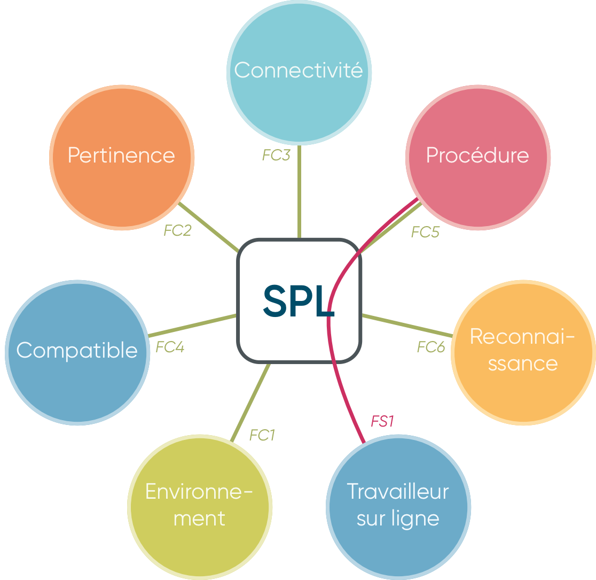

\newpage

#   Réalisation de la mission de stage

Au cours de cette section, nous allons aborder le travail effectué au cours du stage en lui-même. Nous allons partir d'une présentation de l'existant, de la problématique lors de mon arrivée en entreprise et du besoin qui en découle; pour ensuite voir comment une solution a pu être imaginée et si elle permet de répondre à ce besoin.\

Dès mon arrivée, Monsieur Laurent STEIN, mon tuteur de stage, m'a guidé pour utiliser une méthode de gestion de projet: le **PDCA**. Je l'ai légèrement adapté pour obtenir la méthode **PSDCA**, à cause du temps limité lors de ce stage de 12 semaines. À la place d'essayer de potentielles solutions, je choisis directement une solution à partir du périmètre du projet, qui me servira de fil rouge tout le long du projet.

|   Étape   |  Description  |
|:-----------|:--------------|
|   Plan  |   Identification et établissement du périmètre du projet. |
|   Seek  |   Recherche de solutions et bilan faisable / non-faisable. |
|   Do   |  Développement de la solution retenue.   |
|   Check |   Mise en production et recherche de résultats.  |
|   Act   |   Amélioration et optimisation à partir des résultats. |
Table: Étapes de ma méthode de gestion PSDCA.

La première étape étant la planification du projet, il convient de définir dès maintenant plusieurs éléments; l'objectif de stage, et la problématique. Ces deux éléments nous permettrons de définir le périmètre du projet, de déterminer les contraintes pertinentes et de trouver une solution proposant le meilleur compromis.

\newpage

##  Objectif de stage

Tel qu'il a été défini dans la convention de stage, l'objectif (ou l'intitulé) est le suivant:

 >  Création d'un support informatique sur les procédures de travail sur ligne.

Bien que cet intitulé soit assez explicite, il peut être ambiguë; Un support physique ou logiciel ? Qu'est-ce qui est défini comme une procédure de travail sur une ligne ?\
Pour simplifier les choses, il est question lors de ce rapport de **créer un logiciel-outil informatique permettant d'accéder à des documents de maintenance et de formation de divers équipements présents sur des lignes de production**.

##  Problématique

Comme vu lors de la présentation de l'entreprise, Ondal est un site de production de produits. Afin d'assurer le bon fonctionnement de l'usine et une bonne qualité de produits, il est nécessaire d'instaurer des procédures uniformisant les actions à mener. Le but est que n'importe qui, après avoir lu une procédure, soit capable d'effectuer les actions qui y sont décrites. Par exemple, où et comment lubrifier un rail de guidage d'une remplisseuse de bouteilles.\
Ces procédures, servent alors à la fois de formation pour les nouveaux personnels, et de rappel si des opérations plus complexes sont nécessaires.\

Dans l'état actuel des choses, ces procédures sont des feuilles de données *Excel* stockées dans des dossiers sur un disque réseau partagé. Afin de les consulter, il est fortement recommandé d'utiliser des bases de données *Access* crées pour. Celle contenant les procédures de formation sont dans la base de données **eQualif**, les autres dans la base **eJOBOP**.\

Le soucis, c'est qu'il est très souvent fastidieux et compliqué d'accéder à une procédure en particulier. Par exemple, la procédure associée au vidage de la mémoire tampon d'une trieuse pondérale de la ligne **SG41**, a comme entrée de titre "*Reset Checkweigher*", tandis que toutes les autres trieuses pondérales ont un nom différent.\
De plus, cette base de données est uniquement accessible sur un ordinateur souvent éloigné de l'équipement. Ainsi, cela représente une perte de temps pour à la fois se déplacer sur un ordinateur, mais aussi pour rechercher une procédure en particulier.

Le besoin est alors plutôt clair : il s'agit de **trouver une solution pour automatiser et améliorer la recherche et l'accès des procédures pour un équipement donné**.

##  Recherche de solutions

### Périmètre du projet

Une fois le besoin identifié, il nous reste à établir le périmètre du projet pour avoir une idée claire de la solution à envisager.\
L'outil est en majorité destiné aux opérateurs et techniciens sur une ligne de production. On peut dès lors déterminer les acteurs comme suit:

 *  Cibles : Toute personne travaillant sur ligne de façon régulière ou non.
 *  Fonction : Améliorer et automatiser l'accès à des procédures d'utilisation, maintenance, formation et réparation disponibles sur un disque en réseau partagé.
 *  Matière d'œuvre : Ligne de production sur site.
 *  Produit & service : Service de Procédures sur Ligne (SPL).

À partir de ces élements, il est possible d'utiliser les outils APTES et FAST pour visualiser les contraintes nécessaires en vue de l'établissement du cahier des charges;

\newpage

####    Diagramme FAST

L'outil FAST nous permet d'associer les différents éléments de notre périmètre de projet, pour en obtenir une vue d'ensemble en vue de la recherche de contraintes auxquelles doit répondre notre solution.

{width=30%}

####    Diagramme APTE

Les points clés pris en compte, sont l'**ergonomie** en vue de l'utilisation de l'outil par un travailleur sur ligne, la **connectivité** et l'**intégration avec son environnement**, ainsi que l'**automatisation** du processus. 

{width=50%}

| Fonction |  Description                                                                                          | Flexibilité |
|----------|:------------------------------------------------------------------------------------------------------|:------------|
|   FS1    |   Permettre l'automatisation et améliorer l'accessibilité des procédures sur une ligne de production. |  S0         |
|   FC1    |   Doit pouvoir être utilisé en environnement industriel.                                              |  S1         |
|   FC2    |   Doit fournir une procédure pertinente à la demande.                                                 |  S0         |
|   FC3    |   Doit pouvoir récupérer uniquement les procédures disponibles sur un disque réseau partagé.          |  S0         |
|   FC4    |   Doit être compatible avec n'importe quelle ligne de production.                                     |  S1         |
|   FC5    |   Doit être compréhensible et utilisable par un travailleur sur la ligne.                             |  S1         |
|   FC6    |   Doit pouvoir identifier la demande rapidement et automatiquement.                                   |  S1         |
Table: Fonctions de service et contraintes de notre système.

###  Contraintes

Nous pouvons maintenant nous intéresser aux contraintes à la fois généralistes et techniques de notre projet;

 *  Système **portable**, avec recours à l'utilisation de tablettes numériques.
 *  **Ergonomique**, qui nécessite pas ou peu de formation et soit simple à l'utilisation.
 *  **Compatible avec les infrastructures existantes** comme les disques en réseau.
 *  "**Future-proof**", utilisant des technologies dites "LTS"[^7], n'ayant pas de dépendances externes et des versions bloquées.
 *  **Technologies en libre-accès** ou sous licence dont dispose l'entreprise, comme le pack *Office 365*.
 *  **Processus automatisé**, avec utilisation de codes-barres disposant de la procédure encodée.

####    Licences

Un détail auquel je n'avais pas initialement pensé concernait les licences utilisées. En tant que particulier, je n'étais pas amené à réellement m'en occuper puisque la totalité des logiciels et outils que j'utilise n'ont pas pour vocation à être re-distribués à des personnes tierces. Cependant, dans le cadre professionnel, il est nécessaire de prendre en compte les licences utilisées pour développer un outil.

####    Automatisation

Comme exposé précédemment, une des contraintes de notre solution est l'automatisation. Celle-ci m'a été guidé par mon maître de stage, qui m'a imposé l'utilisation de codes-barres disposant du nom de la procédure à rechercher sur le réseau.\

L'objectif est d'obtenir une solution qui corresponde au diagramme suivant. (Voir [**Figure 4** page 14](Figure 4))

### Solutions envisagées

####    Microsoft PowerApps

La première solution envisagée est l'utilisation de l'application **Microsoft PowerApps** contenu dans le pack *Office 365*.\
Je ne connaissais pas cet outil. Pour expliquer simplement, il permet de **créer des applications avec une interface utilisateur sans programmation pour traiter des données**.

| Avantages |  Inconvénients    |
|:---------------|:---------------|
|   Création d'interface sans programmation.    |   Données en ligne "cloud" uniquement. |
|   Integré dans le pack Office 365 dont dispose l'entreprise    |   Fonctionnalité d'interprétation de codes barres uniquement sous Android et iOS.                                              |
|   Lecture native et facile de codes barres    |   -                                                 |
Table: Bilan des avantages et inconvénients de la solution *Microsoft PowerApps*.

[^7]:   LTS signifie **Long Term Support**.
