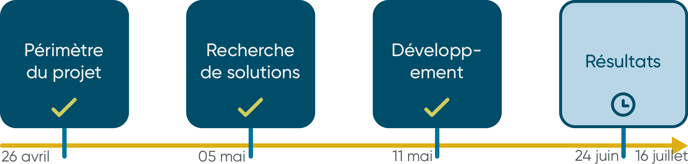

\newpage

#   Conclusions

##  Résumé

À mon arrivée, l'entreprise Ondal -du groupe Mibelle Group- avait une problématique. Les **documents de procédures pour les opérations sur les machines des lignes de production étaient difficilement accessibles**. L'enjeu était de **développer une solution pour une tablette Windows permettant d'améliorer l'accès de celles-ci**, à toute personne étant amenée à devoir les consulter.\
Suite à la définition du périmètre de projet et de la recherche de solutions, la solution **SPL** pour **Service de Procédures sur Ligne** a été développée avec le retour des utilisateurs finaux. Le principe est d'ajouter une étiquette sur une machine, contenant un code QR faisant lien vers une procédure en particulier.\ 
Avec une partie **SPL-app**, on peut **scanner ce code QR qui ouvrira directement la procédure associée au format Excel sur la tablette**; cette sous-solution permet également de prendre des photos et enregistrer des vidéos sur un disque en réseau partagé.\
L'autre sous-solution **SPL-editeur**, permet de **générer ces étiquettes avec le code QR**, en passant par une interface utilisateur.

##  Statut du projet au terme du stage

Au terme du stage, les outils développés sont utilisés et répondent à la problématique. Cependant, il restait encore à **valider le fonctionnement sur une période plus longue** avec les utilisateurs finaux qu'il a fallu convaincre. J'admet que demander à quelqu'un de modifier sa façon de travailler est délicat, surtout lorsque l'on a plusieurs dizaines d'années d'expérience. J'ai donc dû **faire preuve de pédagogie** et presque vendre l'outil avec une approche différente au cas par cas. Néanmoins, j'ai beaucoup appri en terme de communication.

##  Bilan de l'expérience en entreprise

Lorsque je suis arrivé en entreprise fin-avril, j'avais de grosses appréhensions concernant mes capacités à effectuer l'objectif de stage; d'autant plus que j'étais à l'autre bout de la France, loin de toute connaissance et repère. Mon tuteur de stage **Monsieur Laurent STEIN**, et plus tard mon responsable RH **Monsieur Pierre LAMY**, m'ont tout de suite mis en confiance en m'accueillant avec le sourire.\

J'ai adoré l'ambiance en entreprise. Sincèrement, je ne pense pas m'être levé un matin sans avoir envie d'y aller. Les raisons en sont multiples; bien qu'il y eût de l'attente de résultats, je n'ai reçu aucune pression. Libre de mon temps, je n'ai pas non plus été vu comme un stagiaire en manque de connaissances, mais comme quelqu'un qui avait des compétences qui les intéressait pour contribuer à développer leurs activités.\

Enfin, j'ai pu développer énormément de compétences et connaissances, aussi bien professionnelles que personnelles. J'ai à la fois utilisé des **compétences acquises en Bachelor de Technologie** : **gestion de projet**, **recherche de contraintes et solutions**, **communication** ou encore **informatiques**, mais aussi des compétences personnelles comme en développement informatique d'application, ainsi qu'en **anglais** avec toutes les licences et documentations lues.

##  Bilan personnel

Pour la première fois lors d'une expérience professionnelle, j'ai eu de la considération pour mon travail effectué, et les mots me manquent pour décrire ce sentiment. Je sais que ça a beaucoup joué sur mon humeur, et l'enthousiasme apporté lors de ce stage.\

En plus du côté professionnel, j'ai découvert l'Alsace et la Lorraine. Entre le massif des Vosges et des Ardennes, l'environnement a profondément été marqué par la guerre et l'occupation allemande. Un week-end, mon tuteur de stage m'a fait découvrir une partie de la ligne *Maginot* ainsi que des spécialités locales, c'est dire comment je m'entendais avec lui.\

Je reviens de ce stage, avec en tête une idée complètement différente du monde de l'entreprise, ainsi qu'une meilleure confiance en moi concernant mes capacités. Malgré la distance, le manque de repères et l'amertume qui s'installait parfois, avec du recul, ces douze semaines de stage ont été parmi les meilleures de ma vie, et si c'était à refaire, ce serait sans hésiter.

#  Annexe 1 - Plan du site

{width=95%}

#  Annexe 2 - Organigramme de l'entreprise

{width=80%}
