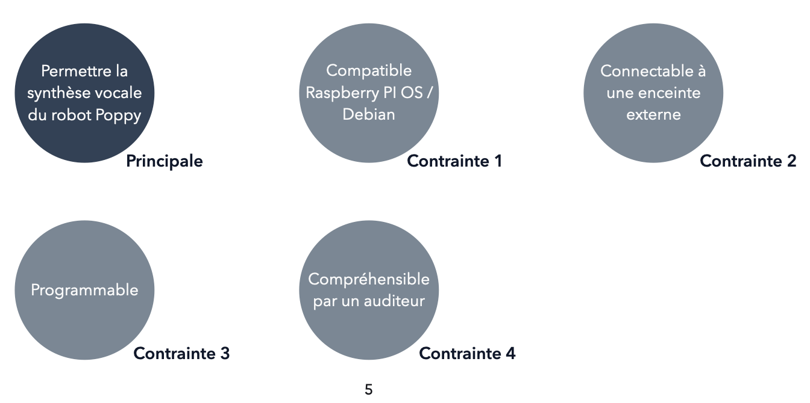
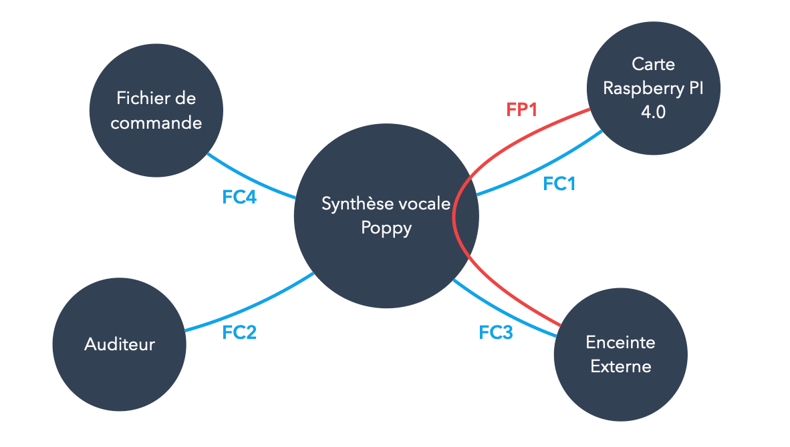
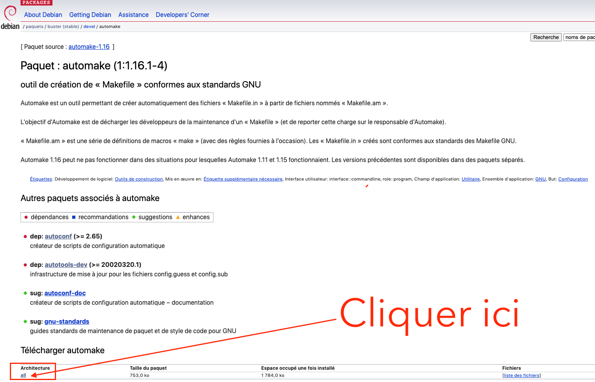
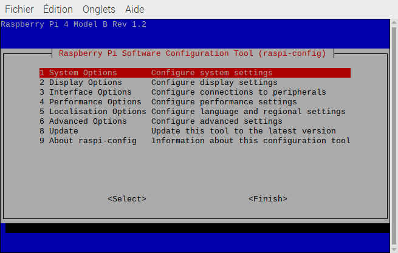
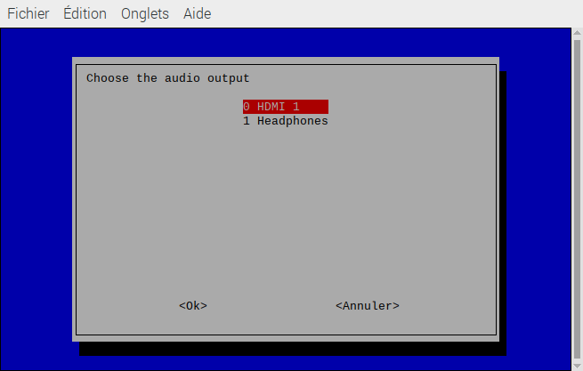

---
title: "Synthèse vocale Text-To-Speech pour Poppy"
author: [Julien HUYGHE]
date: "2021-03-07"
subject: "Poppy"
keywords: [Poppy, TTS]
subtitle: "Donner la parole aux Poppy."
lang: "fr"
titlepage: true,
titlepage-text-color: "FFFFFF"
titlepage-rule-color: "360049"
titlepage-rule-height: 0
titlepage-background: "assets/background.pdf"
toc: true
toc-title: Table des matières
...

\newpage

# Introduction
Dans le cadre de notre deuxième année de *Bachelor de Technologie*, nous sommes amenés à travailler de façon *collaborative* sur un projet commun: le robot **Poppy Torso**. Le but est de nous donner une première expérience de travail de groupe autour d'un projet commun, et avec les contraintes d'un cahier des charges en plus des contraintes techniques.


Ce projet étant *collaboratif*, nous nous sommes répartis en plusieurs groupes et attelés à plusieurs tâches parfois bien différentes; **conception d'une nouvelle main** pour pouvoir dessiner, une **nouvelle tête** afin d'y intégrer un nouvel écran, ou encore la **mise en place d'une synthèse vocale** à partir de texte, donnant une nouvelle dimension plus humaine à *Poppy*, et qui est ce dont ce rapport rend compte.

\newpage

# Cahier des charges initial

Avant de passer à toute la partie technique, nous allons nous concentrer sur le besoin de la synthèse vocale en elle-même.
Nous voulons un système qui permette de transformer du texte pré-enregistré en paroles compréhensibles par un auditeur. On ne parle ici pas de **communication**, mais plutôt de **message** car l'information ne va que dans le sens *robot* $\to$ *auditeur*.

>   Il serait possible d'établir une réelle communication avec un logiciel d'interprétation de type *Speech-to-Text* (STT), mais cela ne sera pas abordé lors de ce rapport.

## Contraintes
Nous voulons donc que notre robot *Poppy* puisse interagir oralement avec un auditeur. La première contrainte qui se pose alors, est que notre synthèse vocale doit pouvoir être **compréhensible par un auditeur**. Il faut donc que l'on ait un *accent proche du français*, une *intonation similaire à une voix humaine*, et un *débit de mots ni trop lent, ni trop rapide*.

Une autre contrainte est la question de la **compatibilité**. La solution matérielle et logicielle du robot *Poppy Torso* étant très précise, il nous faut une solution adaptée qui puisse fonctionner de façon stable et si possible le plus simplement possible.

### Contrainte matérielle
Le robot *Poppy Torso* fonctionne à l'aide d'un microcontrôleur *Raspberry PI 4 Model B*. Cette carte dispose d'une puce *Broadcom BCM2711* avec quatre cœurs *Cortex-A72* en 64 bits architecture **_ARM_**. Nous disposons également d'un port *jack* quatre pôles qui peut nous fournir une **sortie audio stéréo**, utile pour nous connecter directement à une enceinte externe par exemple.

### Contrainte logicielle
Le microcontrôleur *Raspberry Pi 4 Model B* peut faire tourner n'importe quelle application sous architecture *ARM*, celui-ci étant doté dans notre cas de *4Go de RAM*, ce qui reste suffisant pour un usage basique. Dans notre cas, nous allons utiliser une distribution de linux qui a pour base **Debian** et qui est celle recommandée par les créateurs de la carte *Raspberry Pi 4*: **Raspian**.
Enfin, il faut que l'on puisse **programmer** ces messages de synthèse vocale pour qu'ils interviennent lorsque l'on le souhaite.

\newpage

En résumé, nous avons les fonctions de service et de contraintes suivantes:

{width=95%}

Ces différentes contraintes peuvent alors être placées dans un diagramme type **APTE** qui permet une meilleure lecture et déterminer les fonctions associées au système:

{width=95%}

Le **détail de ces niveaux** est présenté sous le tableau ci-dessous:

| Fonctions | Critères | Niveaux | Flexibilité |
| :------- | :-----: | :-----: |    :---------: |
| **FS1** Permettre la synthèse vocale du *Poppy* | Fichiers compatibles | ASCII | FS0 |
| **FC1** Doit fonctionner avec une *Raspberry Pi 4* | Compatible avec l'OS et l'architecture *ARM* | *Raspian* et *ARM* | FS0 |
| **FC2** Doit être compatible pour un être humain | Paramètres de voix | NS | FS1 |
| **FC3** Doit fonctionner avec une enceinte externe | Connexion avec la carte | Port *jack* 4 pôles | FS0 |
| **FC4** Doit pouvoir être programmable depuis un cahier *iPython* | Fichier *iPynb* | Un seul fichier | FS0 |

**Note:** *NS - Non-Spécifié*

Cela conclu notre partie cahier des charges. Nous allons désormais nous concentrer sur l'**intégration et la mise en place de cette synthèse vocale** sur notre carte *Raspberry Pi*.

\newpage

#   Application

##  Généralités
À partir des recherches effectuées sur internet, nous obtenons plusieurs résultats et potentielles solutions, avec chacunes leurs contraintes et fonctionnalités associées:

-   eSpeak
-   Festival
-   Google Text-to-Speech
-   PicoTTS

Ci-dessous, nous allons détailler chacune de ces solutions:

**eSpeak** a été créé en 2006 par *Jonathan Duddington*. Écrit en *C* et *C++*, il est compatible *Linux*, *Windows* et *Mac OS*, et est notamment la première synthèse vocale par *Google Traduction*. Très **rapide à mettre en place** et présent dans le dépot *Debian* par défaut, il est également **très personnalisable**. Il est pas exemple possible de modifier la hauteur de voix, la vitesse, l'attente entre les mots, etc. Cependant, la **qualité sonore laisse à désirer**, si bien qu'il est parfois difficile de comprendre ce qui est exprimé.

**Festival** quant à lui, a été développé au *centre pour la recherche de technologie de la parole de l'université d'Édimbourg*. Tout comme *eSpeak*, il est très **rapide à mettre en place** et il existe une **grande documentation** en ligne. Cependant, il **ne supporte pas le français** officiellement, et la **voix est très robotique**. C'est pour cela que dans le cadre de notre projet où l'une des contraintes du cahier des charges est d'être le plus compréhensible possible par un auditeur, **nous ne le retenons pas**.

**Google Text-to-Speech** est la solution de synthèse vocale développée par *Google* pour ses services (*Android*, *Google Traduction*), et mis à disposition en ligne contre des forfaits payants. Certaines options sont cependant gratuites jusqu'un certain quota de caractères restranscrits. Dans notre cas, il resterait payant malgré tout. **Énormément d'options de voix et de documentation sont fourni, et on ne peut pas faire mieux actuellement en terme de qualité de voix**. Cependant, il repose sur une *API* qui requiert une connexion permanente à Internet. Cela n'a pas été évoqué avant, mais il s'avère que notre carte *Raspberry Pi* doit générer son propre réseau *Wi-Fi* pour être commandée à distance par un ordinateur via *SSH*. Ainsi, il n'est pas possible d'avoir recourt à un service en ligne sauf si l'on dispose d'une carte *Wi-Fi* supplémentaire.
Ainsi, **nous ne pouvons par le retenir**.

**PicoTTS** est un logiciel **open-source** de synthèse vocale integrée dans la version grand public d'*Android*: *Android AOSP*. Celui-ci dispose **ne dispose pas d'une grande variété d'options**, ni d'une bonne documentation, mais est **_compatible_ avec n'importe quel noyau _UNIX_** à condition de devoir le compiler soi-même. De plus, il dispose d'une **bonne qualité de voix**.

##  Choix de la solution

Nous avons exclu Festival et Google Text-to-Speech, pour les raisons évoquées précédémment. Nous nous retrouvons alors avec **eSpeak** et **PicoTTS**. Puisque la qualité de voix est primordial et que par défaut, *PicoTTS* propose une plutôt bonne qualité de voix sans avoir besoin de le re-configurer, nous décidons de partir sur celui-ci, avec en deuxième recourt *eSpeak* au cas-où on aurait besoin de l'utiliser, et ce même en ayant besoin de le configurer.

##  Installation

### eSpeak

L'installation de **eSpeak** est très directe. Une version stable et compatible **ARM** (*armh*) est disponible dans les dépôts par défaut. Il nous suffit d'installer le logiciel en lui-même ([**espeak**](https://pkgs.org/download/espeak) \[[^1]\]), ainsi que sa librairie partagée ([**libespeak**](https://pkgs.org/download/libespeak) \[[^2]\]).

```bash
sudo apt-get install libespeak
sudo apt-get install espeak
```

Il nous reste plus qu'à fermer et relancer une fenêtre de terminal pour pouvoir utiliser la commande:

```bash
espeak
```

### PicoTTS

Pour le second logiciel, **PicoTTS**, les choses sont un peu plus compliquées. Il n'existe pas de version compatible avec notre achitecture de carte. Heureusement, on dispose du code-source disponible sur *GitHub*, [**sur ce lien**](https://github.com/naggety/picotts) \[[^3]\]. On peut alors le compiler pour qu'il soit compatible avec l'architecture *ARM* de carte *Raspberry Pi 4*.

La première étape est de se placer dans un répertoire de son choix (à mettre à la place de **{repo}**) et de cloner la source:
```bash
git clone https://github.com/naggety/picotts.git .
```
Une fois le dépôt *master* copié, il nous faut faire une petite analyse avant de continuer.
De base, *Raspian* a très peu de paquets, aucun outil de développement, juste ce qu'il lui faut pour fonctionner. Cependant, nous avons besoin de plusieurs outils pour utiliser la commande *make*, qui permet de compiler notre logiciel. En lisant la documentation sur *GitHub* et le script **{repo}/picotts-master/pico/autogen.sh**, on peut voir qu'il nous faut les outils suivants:

-   autoconf
-   automake
-   libttspico-utils
-   libtoolize
-   aclocal

Puisque rien n'est jamais simple, plusieurs paquets ne sont pas présents dans les dépôts. Il nous faut alors aller chercher et installer manuellement les paquets ainsi que leurs dépendances sur le [**dépôt internet de Debian**](https://packages.debian.org/buster) (version *buster* - stable) \[[^4]\].

Ci-dessous, un tableau récapitulatif des paquets à installer avec leurs dépendances:

|   Paquet    |  Dépendance(s)    |  Disponibilité    | Adresse (référence) |
|   :-------  |    :-----:    |  :-----: |  :-----:  |
| autoconf | debianutils / m4 / perl | Internet | [**Lien**](https://packages.debian.org/buster/autoconf) \[[^5]\] |
| automake | autoconf / autotools-dev | Internet | [**Lien**](https://packages.debian.org/buster/automake) \[[^6]\] |
| libttspico-utils | libc6 / libpopt0 / libttspico0 | Internet | [**Lien**](https://packages.debian.org/buster/libttspico-utils) \[[^7]\] |
| libttspico-data | NS  | Internet | [**Lien**](https://packages.debian.org/buster/libttspico-data) \[[^8]\] |
| libtoolize | NS | Terminal | NS |
| aclocal | NS | Terminal | NS |
| _ debianutils | NS | Terminal | NS |
| _ m4 | NS | Terminal | NS |
| _ perl | NS | Terminal | NS |
| _ autotools-dev | NS | Terminal | NS |
| _ libpopt0 | NS | Terminal | NS |
| _ libpopt-dev | NS | Terminal | NS |

**Notes:** *NS - Non-spécifié*. **libc6** est normalement inclu de base avec *Raspian*. Le symbole _ est pour des questions de lisibilité, il signifie dans notre tableau que le paquet est une dépendance et n'est pas directement utilisé, mais n'est pas à prendre en compte dans le nom du paquet. Enfin, on a besoin de **libpopt-dev en plus** de **libpopt0** car celui-ci comporte des fonctions en plus qui ne sont pas présentes dans **libpopt0**.


####    Installation pas-à-pas

Maintenant que nous connaissons les paquets à installer ainsi que leurs dépendances, nous allons faire comme suit pour mettre en place le bon environnement pour compiler *PicoTTS*;
On commence par installer les dépendances:
```bash
sudo apt-get install debianutils m4 perl autotools-dev libpopt0 libpopt-dev
```
**Le terminal se charge tout seul de rechercher et d'installer les dépendances compatibles.**

Ensuite, on peut installer les paquets nécessaire pour compiler *PicoTTS*:
```bash
sudo apt-get install libtoolize aclocal
```
Encore une fois, le terminal se charge de tout, il suffit de **rentrer le mot de passe**.

Il nous reste à télécharger les paquets non-disponibles sur le dépôt distant; soit *autoconf*\[[^5]\],
 *automake*\[[^6]\], *libttspico-utils*\[[^7]\] et *libttspico-data*\[[^8]\].
Il faut descendre en bas de page, cliquer sur **all** (voir **_Figure 4_**), et choisir un serveur de téléchargement; de préférence *ftp.fr.debian.org/debian*.

Une fois téléchargés, les paquets s'installent en les exécutant et en renseignant le mot de passe.

{width=55%}

####    Compilation de PicoTTS

Nous pouvons dorénavant compiler *PicoTTS*. Il suffit de suivre le *README.md* présent sur la page *GitHub* de *PicoTTS*.
Après avoir ouvert une console;
```bash
cd {repo}/picotts-master/pico
./autogen.sh
```
On laisse faire le terminal, puis une fois terminé:
```bash
./configure
make
make install
```

Cela peut prendre plusieurs minutes, voir une dizaine de minutes. Le mieux à faire est de laisser la carte *Raspberry Pi* travailler et ne pas faire autre chose dessus pendant ce temps-là. Si tous les paquets requis et leurs dépendances sont installées, tout devrait se dérouler normalement.

Une fois compilé, on obtient un fichier *pico2wave* dans le dossier *pico*. On peut alors faire un ajout à notre *variable d'environnement* ***PATH***, afin d'accéder à **pico2wave** depuis n'importe quel dossier dans notre terminal. On exécute la commande suivante:
```bash
export PATH=$PATH:{repo}/picotts-master/pico
```
Et on relance le terminal.

\newpage

#   Utilisation

Maintenant que nous disposons de deux logiciels de synthèse vocale - **eSpeak** et **PicoTTS** -, nous allons nous intéresser à leur utilisation.

**PicoTTS**, ne génère pas de synthèse vocale à proprement parler. Le programme *pico2wave* créé un fichier *.wav* avec la synthèse vocale qu'il est alors possible de lire par la suite. L'avantage est qu'il est alors possible de générer en amont les fichiers vocaux, afin d'être sûr de la qualité de compréhension de ceux-ci. Cependant, cela implique une utilisation particulière lors de l'utilisation "en direct", c'est pourquoi **nous allons utiliser des scripts** pour programmer le fonctionnement et nous faciliter un peu la vie.

Le script pour **PicoTTS** est le suivant:
```bash
#!/bin/bash
pico2wave -l "fr-FR" -w /tmp/testpicotts.wav "$1"
aplay -q /tmp/testpicotts.wav
rm /tmp/testpicotts.wav
```
2.  En premier lieu, nous générons un fichier de langue française *'-l "fr-FR"'* dans un répertoire temporaire */tmp/*. Le **_$1_ est un paramètre**, qui nous permet de passer des arguments lors de l'utilisation du script, à savoir le texte à retranscrire.
3.  La commande *aplay -q*, nous permet de lire un fichier sans afficher de message ni d'interface, le fichier généré précédemment.
4.  *rm*, permet de supprimer le fichier que nous avons généré une fois la lecture de celui-ci terminé.

Pour **eSpeak**, le fonctionnement est plus simple; celui-ci restranscrit directement le texte qui lui est entré. Pour des questions de simplicité, nous utilisons également un script. Cela nous permet entre autres de **renseigner des paramètres récurrents**, qui ne changent pas en fonction du texte entré, comme la langue, la hauteur de voix, le temps d'attente entre les mots, etc.
```bash
#!/bin/bash
espeak -p 20 -g 2 -vfr+$2 "$1"
```
2.  *-p 20* est la hauteur de voix. *-g 2* signifie qu'il y a 20ms de délai entre chaque mot. *-vfr* permet de spécifier une voix française. **_$2_ est notre deuxième paramètre**, qui permet de spécifier la voix utilisée. Nous avons le choix entre *male* (**m**) **1-7** et *female* (**f**) **1-5**. Enfin, **_$1_ est le paramètre d'entrée du texte**.

Avec ces deux scripts exécutables (**en faisant la commande _chmod 755_ sur les fichiers**), on peut très facilement alterner entre les deux et rendre le tout programmable sous *Python*.

##  Utilisation avec Python

Pour utiliser la synthèse vocale dans un cahier *iPython* (*.ipynb*), on va simplement exécuter nos scripts à l'aide de *Python* (3.8). Nous utilisons pour cela la fonction **subprocess** de la librairie éponyme.
Nous pouvons ainsi créer une méthode python **synthese()**:
```python
import subprocess
def synthese(texte, interpreter="pico", voix="f3"):
    #Concaténation de chaîne de caracteres pour déterminer quel script de synthese vocale à utiliser.
    i = "./parler-" + interpreter + ".sh"
    #Tableau de différents parametres associé aux scripts
    if interpreter != "pico":
        cmd = [i, texte, voix]
    elif interpreter == "pico":
        cmd = [i, texte]
    #Commande à exécuter avec les parametres dans le tableau défini précédémment.
    tmp = subprocess.Popen(cmd, stdout=subprocess.PIPE)
    output = tmp.communicate()[0]
```
De base, nous utilisons **PicoTTS** comme logiciel d'interprétation. Cependant, nous disposons également d'une redondance avec **eSpeak** et comme paramètre par défaut une voix **f3**. Des différents paramètres, c'est **ce qui ressort le mieux après plusieurs essais**.

### Exemples d'utilisation
```python
#Exemple de synthese vocale avec PicoTTS
synthese("Bonjour, je m'appelle Poppy, et ceci est un exemple de synthese vocale avec PICO TTS.")
```
```python
#Exemple de synthese vocale avec eSpeak
synthese("Bonjour, je m'appelle Poppy, et ceci est un exemple de synthese vocale avec ESPEAK.", "espeak", "f5")
```

##  Paramètres disponibles

Comme évoqué précédémment, nous n'avons pas de paramètres modifiables pour **PicoTTS**. En revanche, pour **eSpeak**, il existe une multitude de paramètres trouvables sur le site internet.
Il est également possible de modifier la voix utilisée. Les options de voix utilisables seront données par la suite.
Toutes les commandes sont disponibles sur le [**site internet de eSpeak**](http://espeak.sourceforge.net/commands.html)\[[^9]\].

#   Connexion d'une enceinte externe sur la carte Raspberry Pi

La plupart des enceintes externes disposent d'une connexion *jack* qui permet de sortir ou faire entrer un signal audio. Dans notre cas, nous utilisons une enceinte disposant d'une entrée *jack*, et d'une carte *Raspberry Pi* disposant d'une sortie *jack*. Nous pouvons donc utiliser cette enceinte externe depuis notre carte grâce à un **connecteur jack/jack**.
Normalement, **par défaut**, le flux audio est au format numérique et mêlé à la prise *HDMI* du moniteur connecté à la carte. Lorsque l'on branche un connecteur *jack*, le flux audio est automatiquement redirigé vers cette sortie *jack* analogique. Il peut cependant arriver que ce ne soit pas automatique, il faut donc **changer manuellement de sortie audio**.

Le menu graphique ne disposant pas d'option audio, il faut passer par le menu **CLI** (*Command Line Interface)*, grâce à la commande dans un terminal:
```bash
sudo raspi-config
```


Nous pouvons nous déplacer à l'aide des *touches de navigation*, et de *Entrée*.



En allant dans **1 System Options**, puis **S2 Audio**, on peut sélectionner la sortie audio que l'on souhaite. En faisant *flèche de droite* (l'option est surlignée en bleu), puis *Entrée* pour *\<Ok\>* on peut **valider notre sélection**.
On revient ensuite au menu. **Pour appliquer les changements**, il faut faire deux fois *flèche de droite* pour surligner en rouge *\<Finish\>*, puis *Entrée*, ce qui nous fait quitter l'interface.

On redémarre la carte Raspberry Pi, et la sortie audio est modifiée.

\newpage

#   Conclusions

Il est très facile d'intégrer un programme de synthèse vocale basique sur une carte *Raspberry Pi 4*, et de la paramétrer pour être utilisée à l'aide de cahiers *iPython*.
On pourrait **aller plus loin en modifiant les options lors de la compilation**, ce qui nous permettrait vraiment de modifier comme on le souhaite les paramètres de synthèse vocale. Cependant, cela nous prendrait beaucoup de ressources, du temps particulièrement, et le gain potentiel n'est pas si important que ça dans le cadre de notre projet *Poppy Torso*.

#   Sources

**[Framboise314.fr](https://www.framboise314.fr/)\[[^10]\]**: Un site dédié à divers projets et tutoriels en français pour les utilisateurs de cartes *Raspberry Pi*.
**[Debian.org](https://www.debian.org/)\[[^11]\]**: Site officiel de *Debian*, avec beaucoup de documentation bien expliquée.
**[StackOverflow.com](https://stackoverflow.com/)\[[^12]\]**: Site de questions - réponses autour du domaine informatique, une véritable mine d'or pour résoudre tout problème rencontré.

[^1]: https://pkgs.org/download/espeak
[^2]: https://pkgs.org/download/libespeak
[^3]: https://github.com/naggety/picotts
[^4]: https://packages.debian.org/buster
[^5]: https://packages.debian.org/buster/autoconf
[^6]: https://packages.debian.org/buster/automake
[^7]: https://packages.debian.org/buster/libttspico-utils
[^8]: https://packages.debian.org/buster/libttspico-data
[^9]: http://espeak.sourceforge.net/commands.html
[^10]: https://www.framboise314.fr/
[^11]: https://www.debian.org/
[^12]: https://stackoverflow.com/
